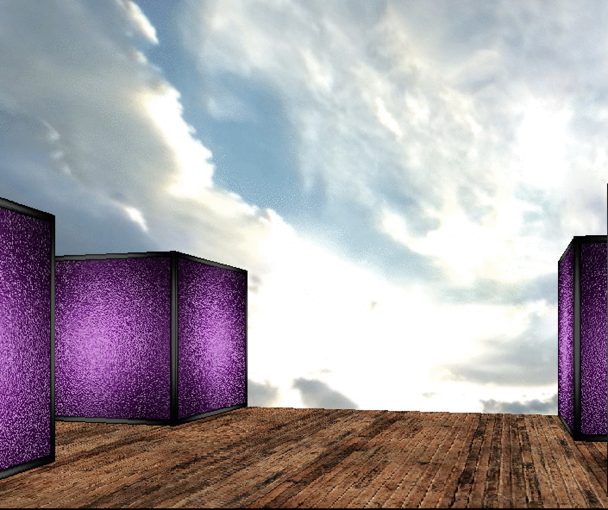

# Wolf3d
Recreation of a 3d labyrinth

## Summary
It's a study project (with 42 coursus) about implementation of raycasting algorithm and building basic game engine.

See more info in pdf "wolf3d.en.pdf"

From the user perspective the goal of the game is to get to the end of the created labyrinth.
While really enjoying the path rather than goal.

### Prerequisites
Current version runs only on iMac systems (due to minilibx and it's Makefile build).

### Installation

To compile run make command in your terminal (while in the folder):
```
make
```

After that simply run ./wolf3d with an argument that takes a path to a map file:
```
./woldf3d [path_to_maps/map_name]
```
For example
```
./wolf3d maps/medium
```

### Inside the game

Once run you'll see a game controls displayed in your terminal:
wolfenstein like movement (W,A,S,D), as well as mouse sides and up-down rotations,
and jumps (space) and runs (left shift).

One of the sceneries you can observe in wolf3d:


Sounds and music forked and run in afplayer.

Music:
Koan - Castle From the Mist

Sounds:
Free lib sounds

## License

This project is licensed under the MIT License - see the [LICENSE.md](LICENSE.md) file for details

## Acknowledgments

* John Carmack and John Romero
* Koan
